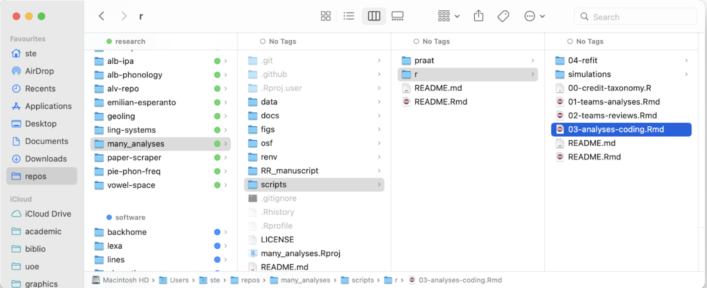
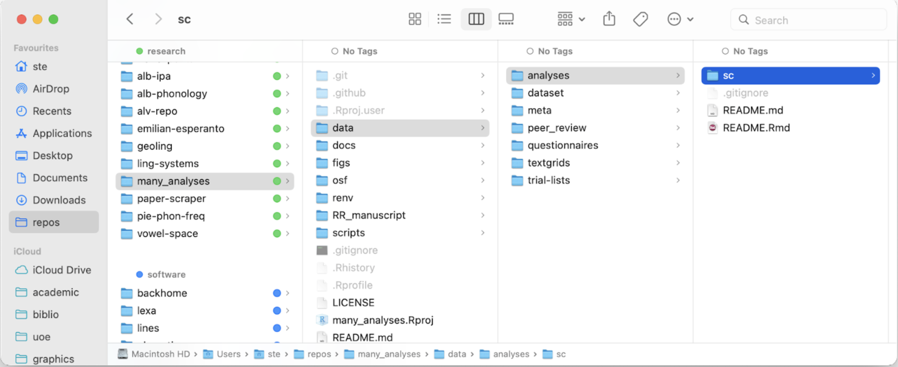

This document describes the workflow for refitting the submitted models and extracting relevant
variables in preparation for the meta-analysis of the MSA data.

## Set up (download OSF components)

Each analyst codes a subset of the MSA data. Accordingly, each analyst
downloads only their subset of OSF components with the data from the
teams analyses.

To do so, run the code in `scripts/r/03-analyses-coding.Rmd`.



When prompted by the code, select your identity. A folder with your
initials will be created in `data/analyses/`. For example:



The rest of the code will download the OSF components into that
directory. (Total size will be ~1 to 4 GB).

## Workflow

1. Pick one of the downloaded teams components (see [Analyses coding](https://docs.google.com/spreadsheets/d/1OOXB-8Uk-fh_urw0Lm4DC0jBueXLIb4Bm-a9--UVXOw/edit#gid=0)).
2. Create a **new heading in your refit file** (`scripts/r/04-refit/refit-xx.Rmd` with the name of the team).
3. **Find the relevant analysis script** of the team
    1. **Run original model as is**.
         Flag if not converging in sheet (column `converged_orig`).
    1. Copy the necessary code in your refit file (`scripts/r/04-refit/refit-xx.Rmd`).
    1. Use the model(s) that are referred to and interpreted in the written report, compare with submitted form and indicate if one of the models has been singled out in submitted form. s
    1. If so, this should also be indicated in the sheet. If the team has multiple models and they do not single one out in the submitted form, run the following re-fitting procedure for all models (**note: be sure to follow naming conventions**, see below).
1. Inside your refit file, MSA team member reruns relevant analyses.
    1. **Standardize predictors**:
        1. Standardize all continuous variables (outcome and predictors) to mean = 0, sd = 1.
        1. Code categorical predictors thus:
            1. Typicality
                1. If categorical and two levels: set `atypical` as
                    reference and use dummy coding. Rename predictor to
                    `effect_cat`.
                1. If categorical and three levels: set `atypical` as
                    reference and use dummy coding. Rename predictor to
                    `effect_cat`.
                1. If continuous, standardize and rename predictor to
                    `effect_con`.
            1. Others:
                1. Sum coding.
        1. If analysts used model selection, use the model which
            analyst eventually chose unless final model did not include
            typicality. In that case, chose simplest model with
            typicality and their chosen critical predictors (e.g.
            analysts chose `Y ~ sex`, you rerun `Y ~ sex + effect_cat`).
    1. **Run standardized model**.
        1. Run standardized model with default priors or with original
            priors if original model was Bayesian and standardised.
        1. If model does not converge, flag in sheet (column
            `converged_std`. Non-convergence is operationalized as over
            20% of the posterior containing divergent transitions.
            1. If model has more than 20% of divergent transitions,
                change `adapt_delta` to 0.99, 0.9999, etc.
            2. If model still doesn't converge, add 2000 iterations.
            3. If tree_depth warning, adjust `max_treedepth` to 12, 14, etc.
        1. **Save model as .rds** file to the **models** directory
          (`data/analyses/models`).
            1. The `.rds` object name should include the team name, the
                model number, the outcome variable (use single words,
                without underscores: `int`, `nounint`, `adjint`, `phrasef0`,
                ..., and whether typicality was categorical or
                continuous (`cat`, `con`). Separate information using
                underscores. Here are two examples:
                `haematopus_fossor_9_nounvowelcent_cat`,
                `lasionycteris_altavela_1_int_con`.
            1. Note that the first two words will always be the team
                name, followed by the model number, followed by the
                outcome variable, and, finally, how typicality was
                coded.
        1. Below is an **example** of a fitted model following all the
            above naming conventions (Note: it also uses the
            `file` argument to automatically save the .rds file):

            ```
            lasionycteris_altavela_1_int_con <- brm(
              int_z ~ effect_con + 
                (1 | target_name) +
                (1 | filename) +
                (1 | filename:target_name), 
              data = MSA_df, 
              cores = 4,
              threads = threading(2, grainsize = 100), 
              backend = "cmdstanr", 
              file = here("data", "analyses", "models", "lasionycteris_altavela_1_int_con")
            )
            ```

1. Repeat for all analyses of MSA team member's subset.

1. Once you have refitted the models, check instructions on how to **Upload refitted models to OSF** in `04-1_refitted.Rmd`.
